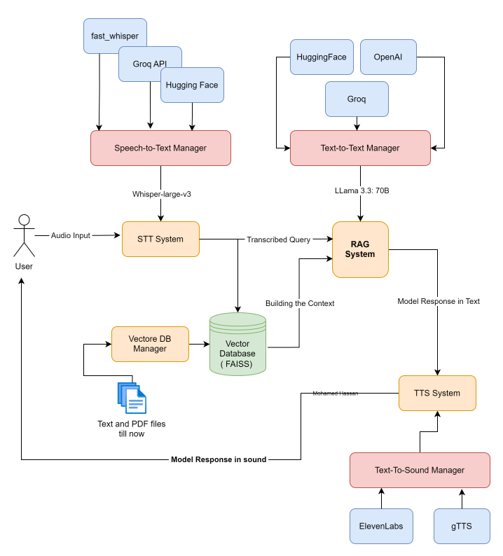

# **Voice Assistant System with Modular Design**

This project demonstrates a modular and extensible **Voice Assistant System** that integrates **Speech-to-Text (STT)**, **Text-to-Text Retrieval-Augmented Generation (RAG)**, and **Text-to-Speech (TTS)** components without relying on external frameworks. The design emphasizes flexibility and scalability, allowing seamless integration or removal of different providers for each subsystem.

**Highlights**:
* Framework-free implementation with a focus on modularity and extensibility.
* Dynamic vector database management for efficient updates.
* Easily scalable due to its OOP-driven architecture.

---
## **System Design**


---

## **System Features**

1. **Framework-Free Implementation**:
   - All functionalities, including STT, RAG, and TTS, are **implemented without relying on external frameworks**, ensuring lightweight and highly customizable code.

2. **Modular Design**:
   - **Three Independent Managers**:
     - **Speech-to-Text Manager**: Modular design for transcribing user audio.
     - **Text-to-Text Manager | Rag_System**: Retrieves and processes user queries using contextual knowledge.
     - **Text-to-Speech Manager**: Converts generated responses to audio with any provider you need.
   - Adding or removing providers for any subsystem is straightforward and requires minimal changes.

3. **Rephrasing and Context Filtering**:
   - Integrates a **rephraser component** to refine the relevant chunks retrieved from the vector database.
   - The rephraser ensures that only the most helpful context is extracted and passed to the query-answering model, improving response accuracy and relevance.

4. **Dynamic Vector Database Management**:
   - **Efficient Change Detection**: The `VectorDatabaseManager` continuously monitors the knowledge base for updates (e.g., added/removed/modified files). The vector database is rebuilt **only when necessary**, optimizing performance and resource usage.

5. **Extensible Providers**:
   - STT, RAG, and TTS managers support multiple providers with provider-specific implementations:
     - **Speech-to-Text Providers**:
       - **Fast Whisper** (Local)
       - **Groq API**
       - **Hugging Face API**
     - **Text-to-Text Providers**:
       - **Groq API**
       - **Hugging Face Models**
       - **OpenAI Models**
     - **Text-to-Speech Providers**:
       - **ElevenLabs**
       - **gTTS**

6. **End-to-End Workflow**:
   - Audio input → Speech-to-Text → RAG Query → Text-to-Speech → Audio output.
   - Both audio responses and textual outputs are provided for user queries.

---

## **To run the application**

1. **Install Dependencies**:
   Ensure all required libraries are installed by running:
   ```bash
   pip install -r requirements.txt
   ```

2. **Set Environment Variables**:
    * Create a .env file using the .env.example file as a reference.
    * Add required API keys and configuration details for the providers.

3. **Start the application using**:
   ```bash
   python main.py
   ```
---

## **Future Enhancements**

This modular design opens the door for exciting improvements. Here are some key ideas where you can contribute:

1. **Real-Time Capabilities**:
   - Implement real-time transcription and response generation for interactive use cases.

2. **Web-Based Interface**:
   - Develop a user-friendly web interface using **Streamlit** or **FastAPI** for easier interaction.

3. **Performance Benchmarking**:
   - Add tools to evaluate and compare the performance of STT, RAG, and TTS providers.
---
### **Let’s collaborate to make this project even better!**
- Fork this repository, implement a feature, and submit a pull request.
- Help test or document the system to improve usability.


